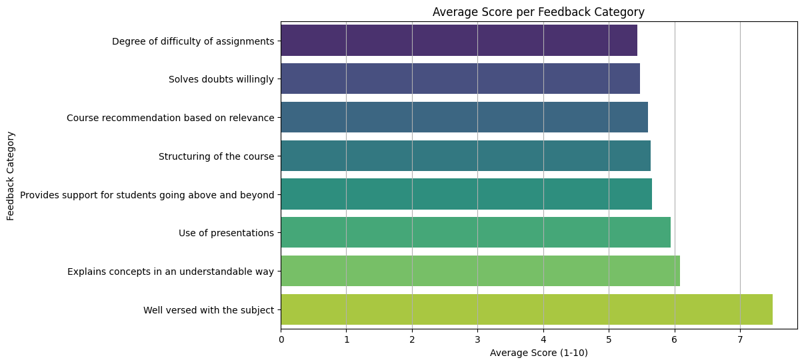
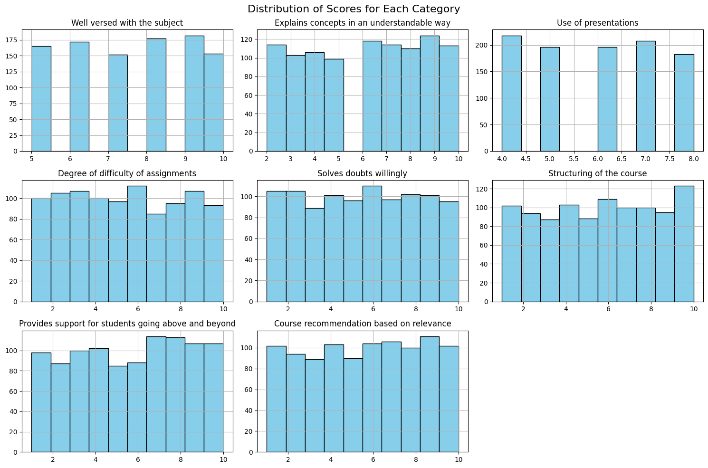
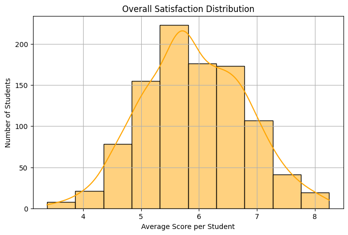
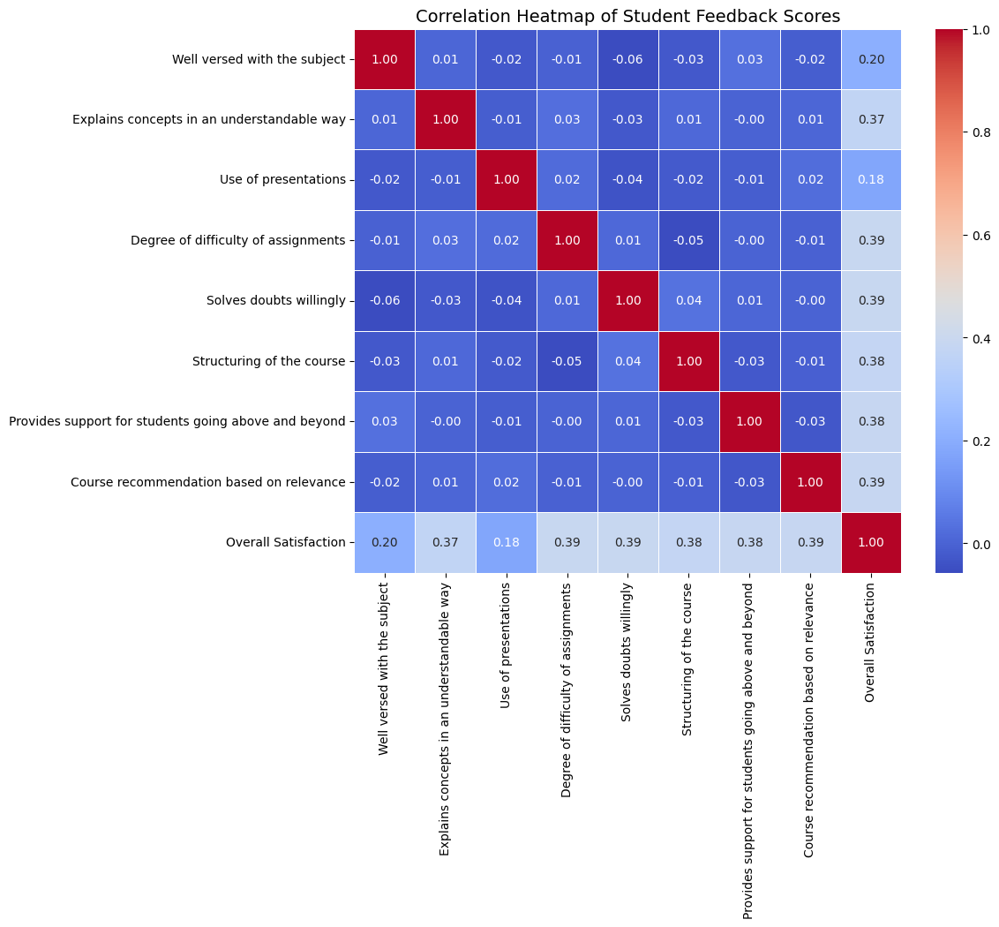

# FUTURE_DS_03
Task 3 for the Data Science &amp; Analytics Internship at Future Interns (student-feedback-analysis)
# 📊 Student Feedback Analysis

This project analyzes feedback from 1,001 students who rated various aspects of a course or instructor on a scale from 1–10. It uses Python libraries such as `pandas`, `seaborn`, and `matplotlib` to uncover key insights and areas for improvement.

---

## 🔍 Summary

- **Highest rated**: *Well versed with the subject* – Avg. score: 7.50
- **Lowest rated**: *Assignment difficulty* – Avg. score: 5.43
- **Key concern**: Communication clarity and presentation delivery
- **Strong positive correlations** between clarity, support, and course recommendation

---

## 📈 Visualizations

- The bar chart illustrates the average student ratings for various indicators of teaching quality. While subject knowledge was rated highly (7.5/10), other areas like assignment difficulty, clarity of explanation, and course structure scored below 6. This suggests a need to improve how content is delivered and supported, even if the instructor is knowledgeable. The chart helped prioritize areas for improvement and guided our recommendations.
  
  
  
- The histogram (Score Distributions) grid shows the distribution of student ratings for each feedback category. Unlike the bar chart, which only displays averages, these charts highlight how spread out or consistent the feedback was. For example, while "Well versed with the subject" received high averages, its histogram confirms that most students rated it between 8 and 10. In contrast, "Assignment difficulty" shows an almost uniform spread from 1 to 10, revealing high variability — some students found assignments manageable, others found them extremely difficult. These patterns provide critical context for interpreting average scores and indicate areas where student experiences differ significantly.
  
- The histogram below also represents the distribution of average satisfaction scores per student across all feedback categories. Most students reported a moderately high level of satisfaction (centered around 5.5–6.5), with relatively few outliers on the low or high ends. The smooth KDE curve confirms a near-normal distribution, which helps validate the reliability of the collected data and indicates that responses are not heavily skewed.
  

  
- Correlation Analysis (Relationships Between Ratings) 
The correlation heatmap below shows how various teaching and support factors relate to overall student satisfaction. The highest correlations were found with course relevance, support for students, structuring, and willingness to solve doubts. Interestingly, subject expertise and presentation usage had the weakest relationships with satisfaction, indicating that interpersonal and practical support may matter more to students than technical delivery alone.

---

## ✅ Recommendations

1. **Maintain strong subject delivery** – This is your top-rated strength.
2. **Improve explanation clarity** – Use analogies, examples, and slower pacing.
3. **Standardize assignment difficulty** – Balance challenge and clarity.
4. **Enhance visual tools** – Upgrade presentation style.
5. **Provide more student support** – Offer more office hours and Q&A time.
6. **Refine course structure** – Organize content to improve flow.

---

## 🛠 Tools Used

| Tool       | Purpose                    |
|------------|-----------------------------|
| Google Colab | Cloud-based Python notebook |
| pandas     | Data manipulation           |
| seaborn/matplotlib | Data visualization      |
| Heatmap    | Correlation analysis        |

---

## 📌 Project Goals

- Identify satisfaction trends
- Use data to support teaching improvement
- Build a clean, visual report for stakeholders

---

## 📎 Files

- `student_feedback.csv` – Cleaned dataset
- `notebook.ipynb` – Python code (in Google Colab)
